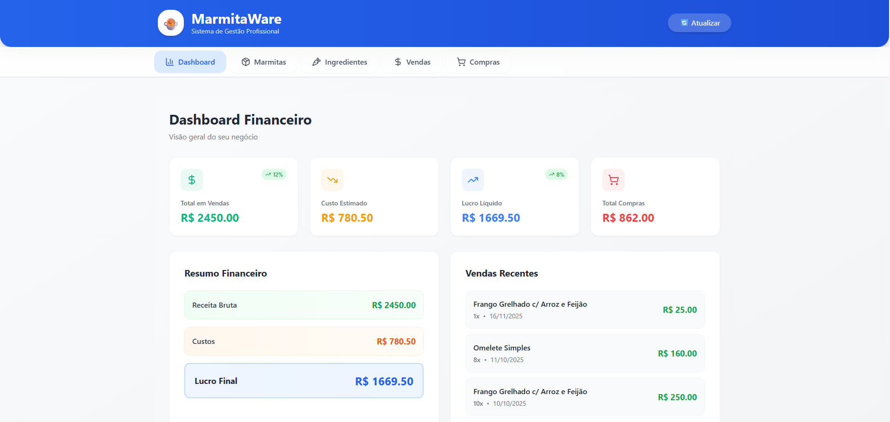
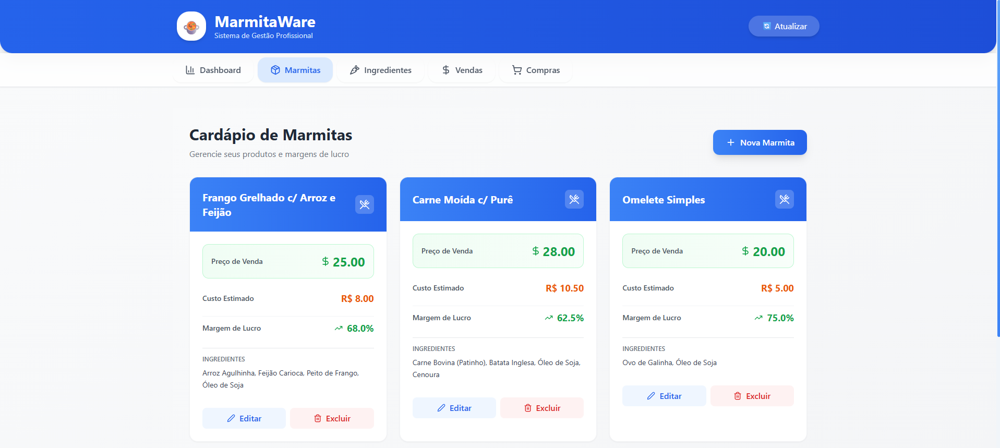
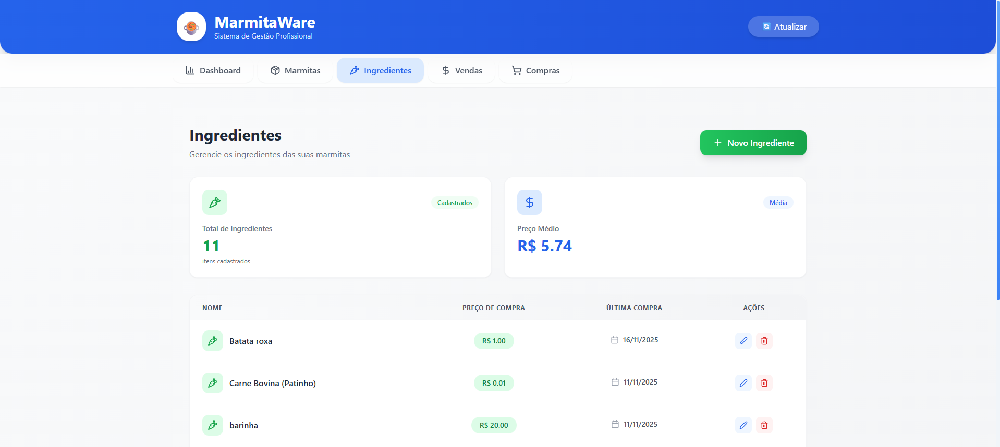
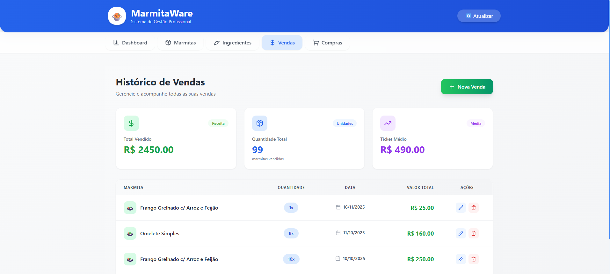
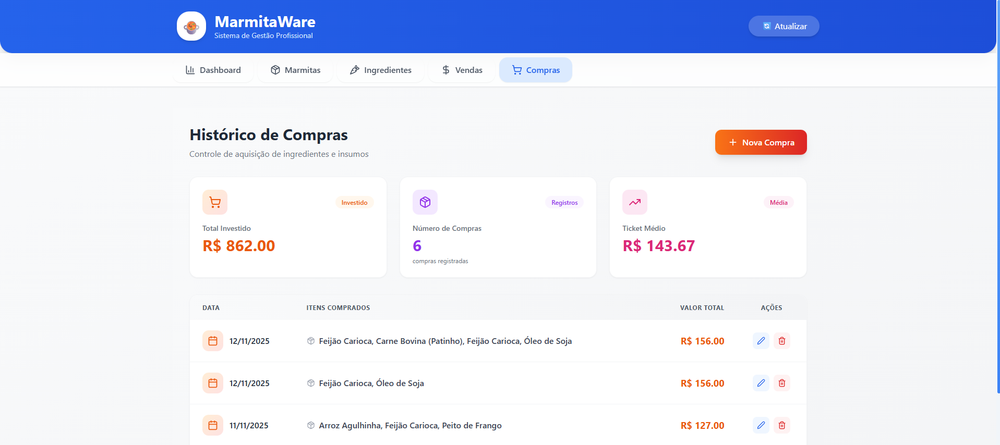

# 🍲 MarmitaWare - Sistema de Gestão para Negócio de Marmitas

Sistema completo e profissional para gestão de negócios de marmitas, desenvolvido para a disciplina de CSI-28.
Controle suas vendas, compras, cardápio e tenha uma visão completa do seu negócio em tempo real.

## 📖 Sobre o Projeto

O **MarmitaWare** é uma solução completa para quem trabalha com venda de marmitas e precisa ter controle total do negócio. Com ele você pode visualizar:

- 📊 **Dashboard Financeiro** - Visualize receita, custos e lucros em tempo real
- 🍱 **Gestão de Cardápio** - Cadastre marmitas com ingredientes e calcule margens
- 💰 **Controle de Vendas** - Registre e acompanhe todas as suas vendas
- 🛒 **Registro de Compras** - Controle gastos com ingredientes e insumos
- 📈 **Relatórios Automáticos** - Dados consolidados para tomar decisões

### ✨ Funcionalidades Principais

- ✅ CRUD completo (Criar, Ler, Atualizar, Deletar) para Marmitas, Vendas e Compras
- ✅ Cálculo automático de custos e margens de lucro
- ✅ Interface moderna e responsiva
- ✅ Dashboard com estatísticas em tempo real
- ✅ Histórico completo de transações
- ✅ Sistema de confirmação para evitar exclusões acidentais

## 🚀 Como Rodar o Projeto

### 📋 Pré-requisitos

Antes de começar, certifique-se de ter instalado:

- **Python 3.8+** - [Download aqui](https://www.python.org/downloads/)
- **Node.js 16+** - [Download aqui](https://nodejs.org/)
- **Git** - [Download aqui](https://git-scm.com/)

### 📥 1. Clone o Repositório

```bash
git clone https://github.com/delnerow/MarmitaWare.git
cd marmitaware
```

### ⚙️ 2. Configurar o Backend (Python/Flask)

Abra um terminal e execute:

```bash
# Entre na pasta do backend
cd backend

# Crie um ambiente virtual (recomendado)
python3 -m venv venv

# Ative o ambiente virtual
# No Linux:
source venv/bin/activate

# Instale as dependências
pip install flask flask-cors pandas

# Rode o servidor
python3 api.py
```

O backend estará rodando em: **http://localhost:5000** 🎉

> **💡 Dica**: Deixe este terminal aberto com o servidor rodando!

### 🎨 3. Configurar o Frontend (React/Vite)

Abra **outro terminal** (mantenha o backend rodando) e execute:

```bash
# Entre na pasta do frontend
cd frontend

# Instale as dependências
npm install

# Rode o servidor de desenvolvimento
npm run dev
```

O frontend estará rodando em: **http://localhost:5173** 🎉

### ✅ 4. Pronto! Acesse o Sistema

Abra seu navegador e acesse: **http://localhost:5173**

Você deverá ver a tela inicial do MarmitaWare! 🚀

## 📁 Estrutura do Projeto

```
Marmitaware/
│
├── backend/
│   ├── classes/
│   │   ├── compra.py                               # Modelo Compra
│   │   ├── venda.py                                # Modelo Venda
│   │   ├── ingrediente.py                          # Modelo Ingrediente
│   │   ├── marmita.py                              # Modelo Marmita
│   │   ├── gerenciadorApp.py                       # Lógica de aplicação
│   │   └── gerenciadorBD.py                        # Classe responsável por criar/acessar BD
│   │
│   ├── database/
│   │   ├── dados.db                                # Banco de dados SQLite
│   │   ├── criar_tabelas.py                        # Cria tabelas do banco de dados
│   │   └── povoar_exemplo.py                       # Povoa tabelas do banco de dados
│   │
│   ├── tests/
│   ├── test_integracao_gerenciadorApp.py           # Testa o fluxo completo do app usando SQLite real
│   │── test_integracao_gerenciadorBD.py            # Testa o GerenciadorBD direto: inserts, joins e leituras
│   │── test_unidade_compra.py                      # Testa a classe Compra isoladamente
│   │── test_unidade_gerenciadorApp.py              # Testa métodos individuais do GerenciadorApp (sem BD real)
│   │── test_unidade_ingredientes.py                # Testa a classe Ingrediente isoladamente
│   │── test_unidade_marmita.py                     # Testa a classe Marmita isoladamente
│   └── test_unidade_venda.py                       # Testa a classe Venda isoladamente
│   │
│   ├── api.py                                      # API Flask principal (rotas)
│   └── requirements.txt                            # Dependências Python
│
├── frontend/
│   ├── src/
│   │   ├── components/                             # Componentes React
│   │   ├── services/
│   │   │   └── api.js                              # Axios configurado
│   │   ├── App.css
│   │   ├── App.jsx
│   │   ├── index.css
│   │   ├── main.jsx
│   │   └── utils.js                                # Artefatos uteis
│   ├── index.html
│   ├── package-lock.json
│   ├── package.json
│   ├── postcss.config.js
│   ├── tailwind.config.js
│   └── vite.config.js
│
└── README.md                                       # Docs gerais do projeto

```

## 📖 Como Usar

### 1️⃣ Dashboard

- Veja estatísticas gerais do seu negócio
- Acompanhe receitas, custos e lucros
- Visualize as últimas vendas

### 2️⃣ Marmitas (Cardápio)

- **Adicionar**: Clique em "Nova Marmita"
- **Editar**: Clique no botão azul "Editar" no card da marmita
- **Excluir**: Clique no botão vermelho "Excluir"
- Veja margem de lucro calculada automaticamente

### 3️⃣ Vendas

- **Registrar**: Clique em "Nova Venda"
- **Editar**: Clique no ícone de lápis ✏️ na tabela
- **Excluir**: Clique no ícone de lixeira 🗑️
- Acompanhe ticket médio e total vendido

### 4️⃣ Compras

- **Registrar**: Clique em "Nova Compra"
- **Editar**: Clique no ícone de lápis ✏️ na tabela
- **Excluir**: Clique no ícone de lixeira 🗑️
- Controle gastos com ingredientes

## 📊 Capturas de Tela

### Dashboard

<div align="center">
  
</div>

### Gestão de Marmitas

<div align="center">
  
</div>

### Registro de Ingredientes

<div align="center">
  
</div>

### Registro de Vendas

<div align="center">
  
</div>

### Registro de Compras

<div align="center">
  
</div>

## 👨‍💻 Autores

Desenvolvido com ❤️ e muito café ☕

**Contato:**

- [Heloísa Rossato](https://github.com/rossatodias)
- [Julia Fernandes](https://github.com/JFernandesLO)
- [Leonardo Trevilato ](https://github.com/trevilato)
- [Maria Del Nero](https://github.com/delnerow)
- [Rhuan Vicente](https://github.com/RhuanV)

<div align="center">

**[⬆ Voltar ao topo](#-marmitaware---sistema-de-gestão-para-negócio-de-marmitas)**

Feito com 💙 por MarmitaWare Team

</div>
